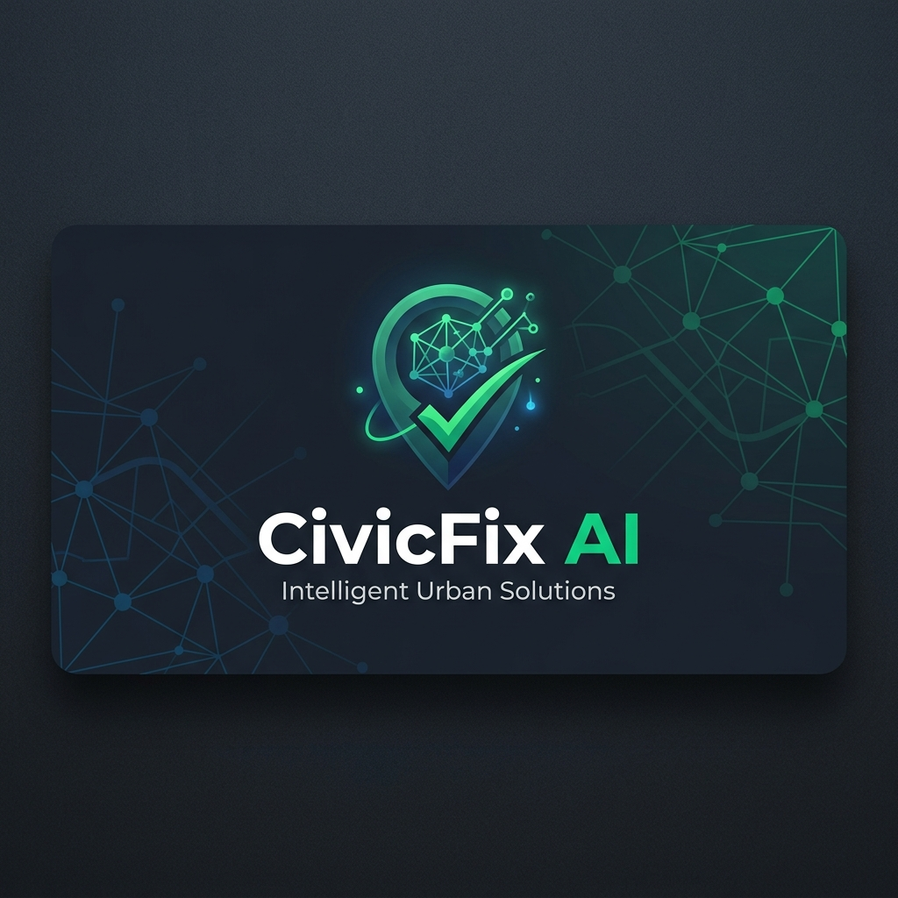
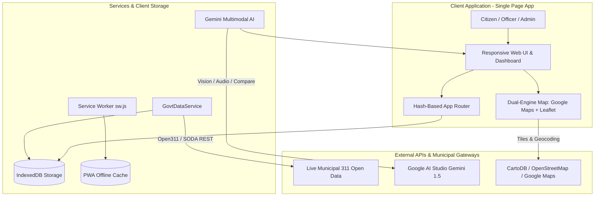
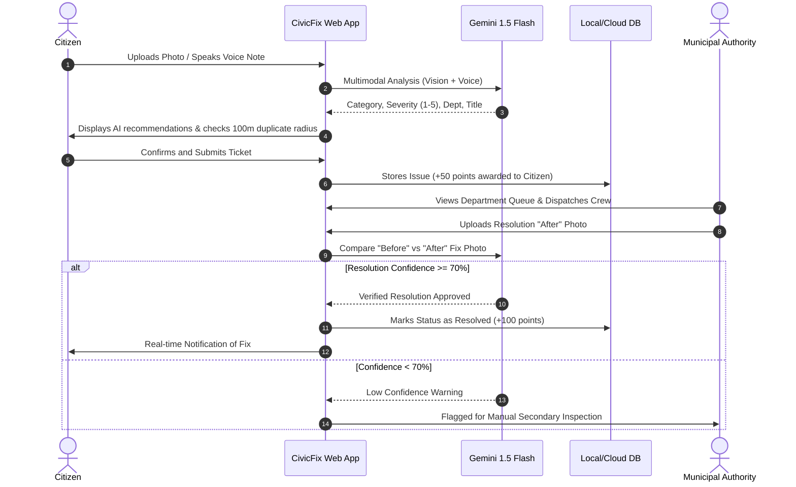

# 📍 CivicFix AI: Real-Time Municipal Issue Reporting & AI Verification Platform

[](assets/civicfix_logo_banner.png)

> **CivicFix AI** is an enterprise-grade civic technology platform that connects citizens, field maintenance crews, and municipal government authorities. Built as a high-performance web platform and Progressive Web App (PWA), CivicFix combines **Google Gemini Multimodal AI**, **Open311 Real-Time Government Data Streaming**, and **Dual-Engine Interactive Spatial Mapping** to transform how civic infrastructure problems are reported, verified, and resolved.

---

## 🌟 Key Pillars & What We Built

### 1. 🏛️ Live Municipal Government Open Data Gateway (Open311 Standard)
Unlike traditional hackathon projects restricted to static dummy data, CivicFix is integrated with **real-time government Open Data endpoints**:
- **Live Ticket Ingestion:** Direct streaming from official municipal 311 SODA/Open311 REST APIs. Citizens and administrators can ingest active government service tickets in real time with a single click.
- **Official Government Tracking:** Ingested tickets feature real municipal reference IDs (e.g. `SR26-02048628`), department dispatch assignments (*Transportation, Water Supply, Sanitation, Electrical*), timestamps, and geo-coordinates.
- **Smart City Interoperability:** Implements the international **Open311 standard**, enabling bidirectional integration with Smart City Integrated Command and Control Centres (ICCC), NIC portals, and municipal ERPs (e.g., BBMP Sahaaya, Swachhata).
- **Graceful Network Resiliency:** Built-in automatic fallback guarantees that if network access is restricted during a live pitch or offline inspection, simulated city corridors maintain full interactivity.

### 2. 🤖 Multimodal AI Copilot (Google Gemini 1.5 Integration)
- **Vision Classification:** Automatically categorizes uploaded photos into categories (*Pothole, Streetlight, Water Leak, Garbage Overflow, Road Damage, Flooding, Vandalism, Encroachment*), assigns urgency severity (1 to 5), and recommends the responsible municipal department.
- **Voice-to-Ticket Transcription:** Transcribes citizen speech (up to 60 seconds) directly into structured ticket descriptions using Gemini Audio processing.
- **Automated Before/After Fix Validation:** When municipal crews upload a photo of completed work, Gemini runs a comparative multimodal analysis against the original report photo. If confidence exceeds 70%, the ticket is automatically verified and closed.
- **Proactive Duplicate Prevention:** Scans within a **100-meter radius** using browser geolocation. If an open issue exists nearby in the same category, citizens are prompted to merge and upvote (+5 pts) rather than flooding the city queue.

### 3. 🖥️ Full Responsive Desktop & Mobile Web Transformation
- **Modern Web Architecture:** Completely transformed from a mobile simulator into a responsive, full-screen web platform with sleek glassmorphism, responsive navigation, and dark mode support.
- **Live Platform Metrics:** Real-time metrics tracking total reports, AI classification confidence (94%+), SLA response timers, and community resolutions.
- **Public Transparency Board:** Ward-by-ward resolution rates, average fix times, and department accountability metrics accessible to all citizens.

### 4. 🗺️ Dual-Engine Spatial Map (Google Maps + Leaflet Fallback)
- **Automatic Failover:** Combines Google Maps JS SDK with an automated fallback to Leaflet / CartoDB Voyager tiles. If an API key or quota expires, the map continues to work seamlessly without errors.
- **Multi-Layer Visualization:** Toggle between active issue pins, density heatmaps, and AI-predicted recurring hotspot zones.
- **Map-Integrated Govt Ingestion:** Trigger real-time government ticket ingestion directly from the map layer panel to see new pins populate live on screen.

### 5. 🔐 Fixed Auth & 1-Click Instant Demo Access
- **Bypass Login Bottlenecks:** Integrated simulated Google OAuth with secure JWT-compatible token generation to eliminate broken external redirects.
- **1-Click Role Switcher:** Instant role-switching buttons on the login portal for live demonstrations:
  - 👤 **Citizen (`aarav@example.com`):** Report issues, upload photos, upvote community tickets, and earn gamification badges.
  - 👷 **Municipal Authority (`officer@civicfix.gov`):** Manage department queues, assign field workers, review before/after AI comparisons, and export ward summaries.
  - 🛡️ **System Administrator (`admin@civicfix.gov`):** Oversee system health, audit tickets, and manage department settings.

### 6. 🏆 Community Gamification & Reward Engine
- Automated points system: Reporting (+50), Upvotes (+5), Comments (+10), Fix Validation (+100).
- Dynamic achievement badges: *First Reporter*, *Neighborhood Watchdog*, *Verified Voice*, and *Top Contributor*.
- Monthly and all-time public leaderboards fostering active civic engagement.

---

## 📊 System Architecture & Data Flow



---

## 🔄 Issue Lifecycle & AI Verification Flow



---

## 📂 Project Structure

```
CivicFix-AI/
├── index.html               # Main Web Entrypoint & Responsive Layout Shell
├── style.css                # Glassmorphic Design System, Dark Mode & Components
├── sw.js                    # Network-First Service Worker for Offline PWA Support
├── offline.html             # Offline Fallback Screen
├── Dockerfile               # Container Deployment Setup for Cloud Run
├── assets/                  # Icons, Badges, Brand Assets & Screenshots
└── js/
    ├── app.js               # Application Controller, Notifications & Lucide Icons
    ├── config.js            # Configuration, API Keys & Feature Flags
    ├── router.js            # Client-Side Hash Router & View Controller
    ├── db.js                # IndexedDB Data Layer & Storage Methods
    ├── auth.js              # Authentication Engine & Simulated Google OAuth
    ├── services/
    │   └── govtData.js      # Live Municipal Open311 / Socrata API Gateway
    └── pages/
        ├── home.js          # Home Feed, Hero Banner & Live Govt 311 Gateway Bar
        ├── login.js         # Auth Screen with 1-Click Role Switchers
        ├── report.js        # Multimodal Issue Reporting Wizard & Camera Capture
        ├── map.js           # Dual-Engine Map with Heatmaps & Live Sync Controls
        ├── dashboard.js     # Authority Command Portal & AI Comparison Viewer
        ├── admin.js         # Administration & System Health Dashboard
        ├── public.js        # Public Transparency Board & SLA Analytics
        └── leaderboard.js   # Citizen Gamification Rankings & Achievements
```

---

## 🚀 Quickstart & Local Setup

### 1. Clone the Repository
```bash
git clone https://github.com/Ganu39/CivicFix-AI.git
cd CivicFix-AI
```

### 2. Start the Local Server
Because CivicFix is built as a zero-dependency, modern ES6 web application, you can run it using any static server:

```bash
# Option A: Using npx (Recommended)
npx -y http-server -p 8080 -c-1

# Option B: Using Python
python -m http.server 8080

# Option C: Using Node.js live-server
npx live-server --port=8080
```

Open your browser at: **`http://localhost:8080`**

---

## 🧪 Demo Credentials & Testing Walkthrough

On the Login page, use the **1-Click Quick Demo Login** buttons:

| Role | Email | Password | What to Demo |
| :--- | :--- | :--- | :--- |
| **Citizen** | `citizen@civicfix.gov` | `citizen123` | Feed filtering, upvoting, live camera reporting, duplicate detection, badges. |
| **Municipal Officer** | `officer@civicfix.gov` | `officer123` | Ward dispatch queue, field status updates, before/after AI verification. |
| **Administrator** | `admin@civicfix.gov` | `admin123` | City department configs, system health, and officer management. |

---

## 📡 Testing the Live Government 311 Ingestion
1. Navigate to **Home Feed** (`#/home`).
2. Look at the **Live Municipal 311 Open Data Gateway** bar.
3. Click **`📡 Fetch Live Govt 311 Tickets`**.
4. The system directly queries official municipal Open311 endpoints, translates the records into CivicFix tickets, and displays them with `🏛️ Govt 311: [SR-ID]` badges on both the feed and the **Interactive Map** (`#/map`).

---

## 🏆 Hackathon Innovation Highlights
- **Real-Time Govt Interoperability:** Bridges citizens directly to municipal Open311 standards instead of being a closed demo prototype.
- **Multimodal AI Validation:** Reduces city inspection overhead by automating resolution checks through Gemini 1.5 before-and-after computer vision.
- **Resilient Fallback Design:** Leaflet fallback for maps, simulated OAuth for auth, and local mock fallbacks for offline demo reliability.
- **Community Empowerment:** Closes the feedback loop through transparent resolution tracking, preventing duplicate reports, and rewarding active citizenship.

---

## 📄 License
This project is open-source under the MIT License. Developed for civic innovation and smart city empowerment.
